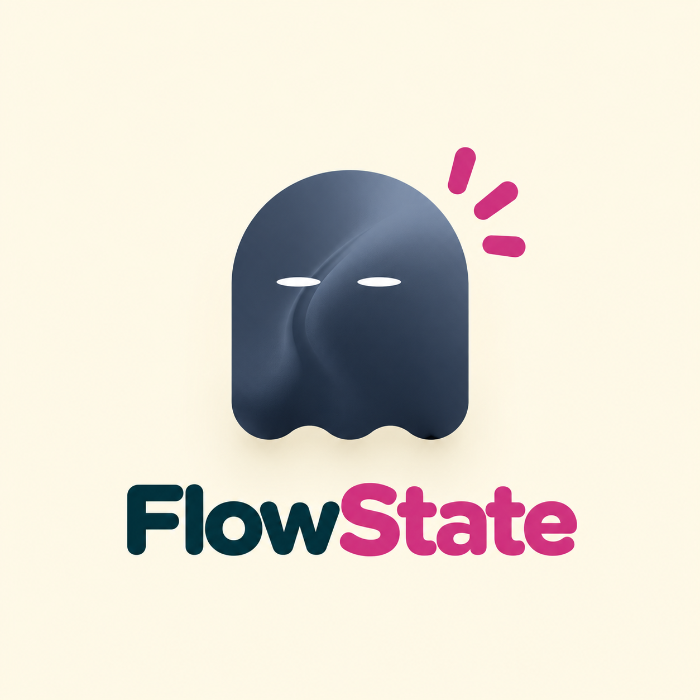

<div align="center">
  
  <h1>
    <span style="color: #073642;">Flow</span><span style="color: #d33682;">State</span>
  </h1>
  <p><strong>AI-Powered Ergonomic Focus & Posture Monitoring Workspace</strong></p>

  <p>
    <a href="#key-features">Key Features</a> •
    <a href="#tech-stack">Tech Stack</a> •
    <a href="#getting-started">Getting Started</a> •
    <a href="#project-structure">Project Structure</a>
  </p>
</div>

---

## 🌟 Overview

**FlowState** is a web-based, AI-assisted productivity workspace designed to keep you focused, hydrated, and ergonomically aligned. Using real-time computer vision in your browser, FlowState continuously monitors your posture score, alerts you to slouching, checks screen distance and ambient room lighting, and tracks your daily focus streaks—all while keeping your camera data entirely private and processed locally on your device.

---

## ✨ Key Features

### Real-Time Computer Vision Engine
- **Posture Score & Slouch Detection**: Calculates real-time body alignment using MediaPipe landmark tracking. Prompts gentle posture correction alerts when slouching is detected.
- **Screen Distance Monitoring**: Ensures optimal viewing distances to prevent digital eye strain.
- **Ambient Lighting Analysis**: Evaluates room brightness for ideal working conditions.

### Interactive AI Companion ("Flowie")
- **Dynamic Mascot**: Powered by animated shader gradients that react to your current focus state.
- **Contextual States**: Transitions between *Asleep* (idle), *Active* (focused session), and *Alert* (slouching detected).

### Analytics & Focus Heatmap
- **LeetCode-Style Activity Graph**: Visualizes daily focus consistency across months with smooth hover details, session counts, and theme-adaptive color gradients.
- **Streak & Water Tracking**: Keeps track of consecutive focus days and logs daily hydration targets.
- **Session History Logs**: Detailed breakdown of completed session durations, posture scores, and water intake.

### Solarized Theme Engine
- **Light & Dark Mode**: Seamless toggle support with custom high-contrast Solarized CSS tokens.
- **Responsive Workspace**: Adaptive layouts for desktop and mobile viewports.

---

## Tech Stack

- **Framework**: [React 18](https://react.dev/) + [Vite](https://vitejs.dev/)
- **Styling**: [Tailwind CSS v3](https://tailwindcss.com/) + Custom CSS Variables
- **Computer Vision**: [MediaPipe Pose Landmark Detection](https://ai.google.dev/edge/mediapipe/solutions/vision/pose_landmarker)
- **Animations & Shader Graphics**: [Framer Motion](https://www.framer.com/motion/) + `@paper-design/shaders-react`
- **Iconography**: [Lucide React](https://lucide.dev/)

---

## 🚀 Getting Started

### Prerequisites

- [Node.js](https://nodejs.org/) (v18.0.0 or higher recommended)
- `npm` or `yarn`

### Installation

1. **Clone the repository**:
   ```bash
   git clone https://github.com/Karanpreet-Singh07/FlowState.git
   cd FlowState
   ```

2. **Install dependencies**:
   ```bash
   npm install
   ```

3. **Start the development server**:
   ```bash
   npm run dev
   ```
   Open your browser and navigate to `http://localhost:5173`.

4. **Build for production**:
   ```bash
   npm run build
   ```

---

## 📁 Project Structure

```text
FlowState/
├── public/
│   └── flowie-logo.png        # Mascot brand logo asset
├── src/
│   ├── components/
│   │   ├── ui/
│   │   │   ├── FlowieLogo.jsx # Reusable logo mark & two-tone text branding
│   │   │   └── shader-svg.jsx # Flowie mascot animated mesh shader
│   │   ├── AnalyticsDashboard.jsx # Analytics page & summary stats
│   │   ├── Dashboard.jsx      # Main live workspace & monitoring feed
│   │   ├── Login.jsx          # User authentication & guest entry
│   │   ├── SessionHeatmap.jsx # Month-grouped activity contribution graph
│   │   ├── SessionHistoryDrawer.jsx # Slide-out navigation & history log
│   │   └── VisionEngine.jsx   # MediaPipe pose landmark computer vision engine
│   ├── utils/
│   │   └── storage.js         # LocalStorage persistence & streak calculation
│   ├── App.jsx                # Root component, state management & theme control
│   ├── main.jsx               # Entry point
│   └── index.css              # Tailwind directives & Solarized theme variables
├── tailwind.config.js
├── vite.config.js
└── README.md
```

---

## 🤝 Contributing

Contributions, issues, and feature requests are welcome! Feel free to check the [issues page](https://github.com/Karanpreet-Singh07/FlowState/issues).

---

<div align="center">
  <sub>Built with ❤️ for focused, healthy deep work.</sub>
</div>
